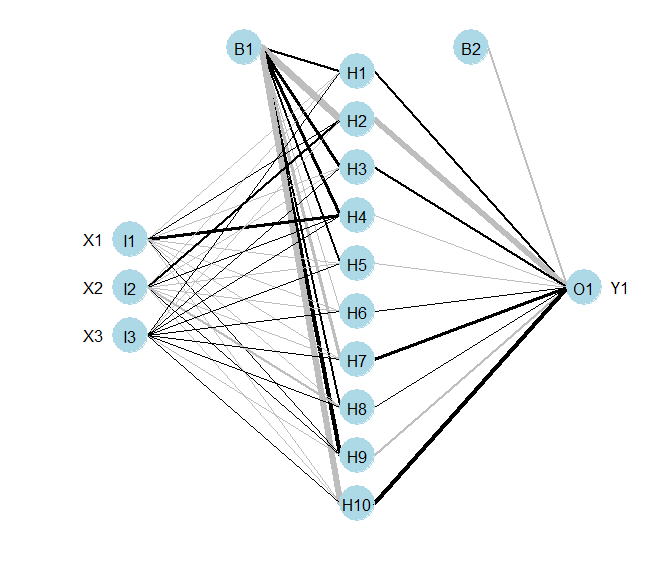
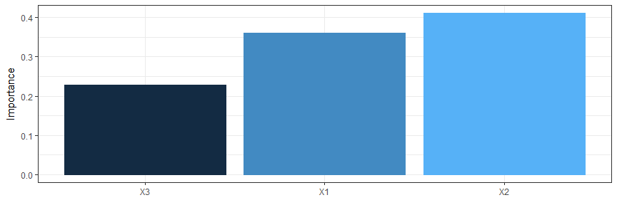
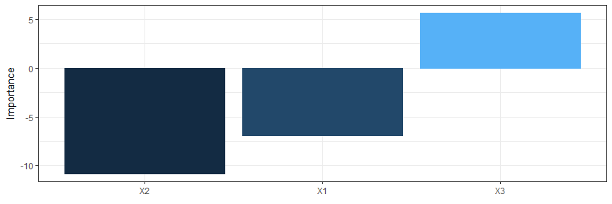
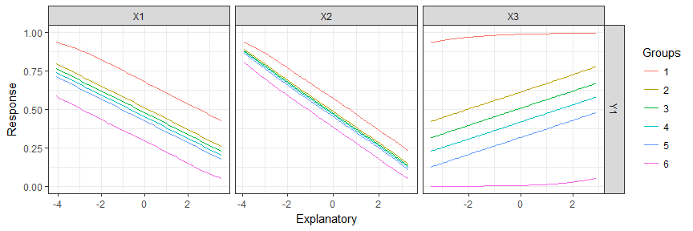

## NeuralNetTools

#### *Marcus W. Beck, mbafs2012@gmail.com*

Linux build: [](http://travis-ci.org/fawda123/NeuralNetTools)

Windows build: [](http://ci.appveyor.com/project/fawda123/NeuralNetTools)

[](http://cran.rstudio.com/package=NeuralNetTools)

This is the development repository for the NeuralNetTools package.  Functions within this package can be used for the interpretation of neural network models created in R, including functions to plot a neural network interpretation diagram, evaluation of variable importance, and a sensitivity analysis of input variables. 

The development version of this package can be installed from Github:


```r
install.packages('devtools')
library(devtools)
install_github('fawda123/NeuralNetTools')
```

The current release can be installed from CRAN:


```r
install.packages('NeuralNetTools')
```

### Citation

Please cite this package as follows:

*Beck MW. 2015. NeuralNetTools: Visualization and Analysis Tools for Neural Networks. Version 1.3.0. http://cran.r-project.org/web/packages/NeuralNetTools/*

### Bug reports

Please submit any bug reports (or suggestions) using the [issues](https://github.com/fawda123/NeuralNetTools/issues) tab of the GitHub page.

### Functions


Four core functions are available to plot (`plotnet`), evaluate variable importance (`garson`, `olden`), and conduct a simple sensitivity analysis (`lekprofile`).  A sample dataset is also provided for use with the examples.  The functions have S3 methods developed for neural networks from the following packages: [nnet](http://cran.r-project.org/web/packages/nnet/index.html), [neuralnet](http://cran.r-project.org/web/packages/neuralnet/index.html), [RSNNS](http://cran.r-project.org/web/packages/RSNNS/index.html), and [caret](http://cran.r-project.org/web/packages/caret/index.html).  Numeric inputs that describe model weights are also acceptable for most of the functions. A full package descriptions is available in the online [manual](http://cran.r-project.org/web/packages/NeuralNetTools/NeuralNetTools.pdf).
 
Start by loading the package and the sample dataset.


```r
library(NeuralNetTools)
data(neuraldat)
```

The `plotnet` function plots a neural network as a simple network or as a neural interpretation diagram (NID). The default settings are to plot as NID with positive weights between layers as black lines and negative weights as grey lines. Line thickness is in proportion to relative magnitude of each weight. The first layer includes only input variables with nodes labelled as I1 through In for n input variables. One through many hidden layers are plotted with each node in each layer labelled as H1 through Hn. The output layer is plotted last with nodes labeled as O1 through On. Bias nodes connected to the hidden and output layers are also shown. 


```r
# create neural network
library(nnet)
mod <- nnet(Y1 ~ X1 + X2 + X3, data = neuraldat, size = 10)

# plot
par(mar = numeric(4))
plotnet(mod)
```

 

The `garson` function uses Garson's algorithm to evaluate relative variable importance. This function identifies the relative importance of explanatory variables for a single response variable by deconstructing the model weights. The importance of each variable can be determined by identifying all weighted connections between the layers in the network. That is, all weights connecting the specific input node that pass through the hidden layer to the response variable are identified. This is repeated for all other explanatory variables until a list of all weights that are specific to each input variable is obtained. The connections are tallied for each input node and scaled relative to all other inputs. A single value is obtained for each explanatory variable that describes the relationship with the response variable in the model. The results indicate relative importance as the absolute magnitude from zero to one.  The function cannot be used to evaluate the direction of the response.  Only neural networks with one hidden layer and one output node can be evaluated.


```r
# importance of each variable
garson(mod)
```

 

The `olden` function is an alternative and more flexible approach to evaluate variable importance. The function calculates iportance as the product of the raw input-hidden and hidden-output connection weights between each input and output neuron and sums the product across all hidden neurons. An advantage of this approach is the relative contributions of each connection weight are maintained in terms of both magnitude and sign as compared to Garson's algorithm which only considers the absolute magnitude. For example, connection weights that change sign (e.g., positive to negative) between the input-hidden to hidden-output layers would have a cancelling effect whereas Garson's algorithm may provide misleading results based on the absolute magnitude. An additional advantage is that Olden's algorithm is capable of evaluating neural networks with multiple hidden layers and response variables.  The importance values assigned to each variable are in units that are based directly on the summed product of the connection weights. The actual values should only be interpreted based on relative sign and magnitude between explanatory variables. Comparisons between different models should not be made.


```r
# importance of each variable
olden(mod, 'Y1')
```

 

The `lekprofile` function performs a simple sensitivity analysis for neural networks. The Lek profile method is fairly generic and can be extended to any statistical model in R with a predict method. However, it is one of few methods to evaluate sensitivity in neural networks. The function begins by predicting the response variable across the range of values for a given explanatory variable. All other explanatory variables are held constant at set values (e.g., minimum, 20th percentile, maximum) that are indicated in the plot legend. The final result is a set of predictions for the response that are evalutaed across the range of values for one explanatory variable, while holding all other explanatory variables constant. This is repeated for each explanatory variable to describe the fitted response values returned by the model.


```r
# sensitivity analysis
lekprofile(mod)
```

 

### License

This package is released in the public domain under the creative commons license [CC0](https://tldrlegal.com/license/creative-commons-cc0-1.0-universal). 
